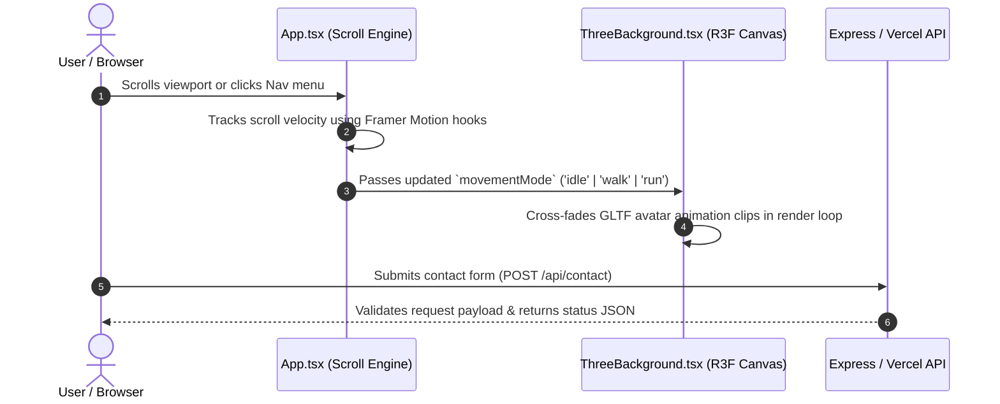

<div align="center">

  <br />

  # 🌌 Kshitij Rastogi — 3D Developer Portfolio

  <p align="center">
    <strong>A next-generation, highly interactive 3D web application powered by React 18, Three.js, React Three Fiber, Framer Motion, and Tailwind CSS.</strong>
  </p>

  <p align="center">
    <a href="#-overview">Overview</a> •
    <a href="#-key-features">Key Features</a> •
    <a href="#%EF%B8%8F-tech-stack">Tech Stack</a> •
    <a href="#-architecture--system-design">Architecture</a> •
    <a href="#-getting-started">Getting Started</a> •
    <a href="#-contact--connect">Contact</a>
  </p>

  <p align="center">
    <a href="https://github.com/rastkshitij/kshitijportfolio"></a>
    <a href="https://threejs.org/"></a>
    <a href="https://www.typescriptlang.org/"></a>
    <a href="https://tailwindcss.com/"></a>
    <a href="https://vitejs.dev/"></a>
    <a href="https://www.framer.com/motion/"></a>
    <a href="https://vercel.com/"></a>
    <a href="LICENSE"></a>
  </p>

</div>

---

## 📖 Overview

Welcome to the official repository of **Kshitij Rastogi's 3D Interactive Portfolio**. 

Engineered with modern web standards and cutting-edge 3D graphics libraries, this portfolio delivers an immersive user experience combining real-time 3D canvas rendering, scroll-velocity-driven avatar locomotion, interactive project showcases, LeetCode problem-solving metrics, and a seamless serverless contact backend.

> [!TIP]
> **Dynamic 3D Locomotion System**: The background 3D avatar dynamically cross-fades animation clips (`idle` ↔ `walk` ↔ `run`) based on real-time scroll velocity calculations powered by `framer-motion` hooks.

---

## 🌟 Key Features

| Icon | Feature | Description | Tech Stack |
| :---: | :--- | :--- | :--- |
| 🎨 | **Interactive 3D Canvas** | Dynamic background scene rendering lighting, custom particle fields, and responsive 3D GLTF avatar models. | `Three.js`, `@react-three/fiber`, `@react-three/drei` |
| 🏃 | **Velocity Locomotion** | Real-time scroll velocity tracking driving smooth avatar animation state transitions (`idle`, `walk`, `run`). | `framer-motion`, `framer-motion-3d` |
| 📊 | **LeetCode Stats Engine** | Interactive coding stats dashboard showcasing total solved problems, difficulty breakdown, and topic tags. | `React`, `Lucide Icons` |
| 💼 | **Career Timeline** | Visual milestone timeline highlighting engineering experience, tech stacks, and key achievements. | `Framer Motion`, `Tailwind CSS` |
| 🚀 | **Projects Showcase** | Dynamic project card grid featuring detailed descriptions, live demos, code repositories, and filter tags. | `React`, `Tailwind CSS v4` |
| 📜 | **Certifications & Resume** | Interactive certification gallery with modal view options and direct resume download. | `React`, Portal Modals |
| 📬 | **Full-Stack Contact** | Functional contact system supporting Express for local development and Vercel Serverless Functions in production. | `Express.js`, `Vercel Serverless` |
| 🌙 | **Glassmorphic UI** | Ultra-sleek dark theme aesthetic with dynamic glassmorphism, responsive grids, and micro-interactions. | `Tailwind CSS v4`, `Lucide React` |

---

## 🛠️ Tech Stack & Ecosystem

<details open>
<summary><strong>Core Engine & Frontend</strong></summary>
<br />

| Technology | Badge | Description |
| :--- | :--- | :--- |
| **React 18** |  | UI Library & Component Architecture |
| **TypeScript** |  | Type-safe Application Logic |
| **Three.js** |  | WebGL 3D Engine |
| **React Three Fiber** |  | Declarative 3D Canvas Renderer |
| **Vite** |  | Next-gen Frontend Tooling & HMR |

</details>

<details open>
<summary><strong>Styling, Motion & UI Controls</strong></summary>
<br />

| Technology | Badge | Description |
| :--- | :--- | :--- |
| **Tailwind CSS v4** |  | Utility-first CSS Framework & Tokens |
| **Framer Motion** |  | Fluid UI Animations & Scroll Velocity Engine |
| **Lucide Icons** |  | Clean, Modern SVG Vector Icons |

</details>

<details open>
<summary><strong>Backend & Deployment Infrastructure</strong></summary>
<br />

| Technology | Badge | Description |
| :--- | :--- | :--- |
| **Node.js & Express** |  | Local Dev API Server & Contact Handler |
| **Vercel** |  | Global Edge Network & Serverless Functions |

</details>

---

## 🏗️ Architecture & System Design

### 📂 Directory Map

```text
kshitij3jsportfolio/
├── 📁 api/
│   └── contact.ts              # Vercel serverless function for contact processing
├── 📁 public/                     # Static assets (3D GLTF models, icons, resume PDF)
├── 📁 src/
│   ├── 📁 components/
│   │   ├── About.tsx           # Technical skills & personal bio
│   │   ├── Certificates.tsx    # Certifications showcase & preview modal
│   │   ├── Contact.tsx         # Interactive contact form & email trigger
│   │   ├── Education.tsx       # Academic background & qualifications timeline
│   │   ├── Experience.tsx      # Professional career milestones timeline
│   │   ├── Hero.tsx            # Hero banner with typewriter animation
│   │   ├── Leetcode.tsx        # LeetCode analytics dashboard & topic stats
│   │   ├── Navbar.tsx          # Navigation bar with smooth scroll triggers
│   │   ├── Projects.tsx        # Portfolio project cards & live links
│   │   ├── Resume.tsx          # Resume modal viewer & download triggers
│   │   └── ThreeBackground.tsx # R3F Canvas, GLTF character loader & animation loop
│   ├── 📁 lib/
│   │   └── utils.ts            # Utility functions (clsx + tailwind-merge)
│   ├── App.tsx                 # Main Application Layout & Scroll Engine State
│   ├── index.css               # Tailwind CSS v4 setup & custom glassmorphism styles
│   └── main.tsx                # Application Entry Point
├── server.ts                   # Express server for local backend testing
├── vercel.json                 # Vercel serverless build & rewrite rules
├── vite.config.ts              # Vite plugins & build optimization config
└── package.json                # Project dependencies & npm scripts
```

### 🧠 Core System Execution Flow



---

## ⚙️ Getting Started

Follow these instructions to set up and run the repository on your local system.

### 1. Prerequisites

Ensure your environment meets the following requirements:
* **Node.js**: `v18.0.0` or higher ([Download Node.js](https://nodejs.org/))
* **Package Manager**: `npm` (v9+) or `pnpm` / `yarn`

### 2. Installation

Clone the project repository and install dependencies:

```bash
# Clone the repository
git clone https://github.com/rastkshitij/kshitijportfolio.git

# Navigate to project root directory
cd kshitijportfolio

# Install package dependencies
npm install
```

### 3. Development Server Modes

You can run the project in standard frontend mode or full-stack API mode:

#### 🟢 Standard Mode (Vite Development Server)
Runs Vite with ultra-fast Hot Module Replacement (HMR):
```bash
npm run dev
```
> Open your browser at: `http://localhost:5173`

#### 🟡 Full-Stack API Mode (Express Local Server)
Runs the Express backend alongside the Vite frontend to test the `/api/contact` endpoint locally:
```bash
npx tsx server.ts
```
> Open your browser at: `http://localhost:3000`

---

## 🛠️ Available npm Commands

| Script | Command | Purpose |
| :--- | :--- | :--- |
| **Development** | `npm run dev` | Starts Vite local development server with HMR |
| **Build** | `npm run build` | Builds optimized production bundle in `dist/` |
| **Preview** | `npm run preview` | Previews production build locally |
| **Type Check** | `npm run lint` | Runs TypeScript compiler checks without emitting code |
| **Express Backend** | `npx tsx server.ts` | Runs Express backend server locally |

---

## 📬 Contact & Social Links

<div align="center">

  <a href="https://github.com/rastkshitij" target="_blank">
    
  </a>
  <a href="https://www.linkedin.com/in/kshitij-rastogi-4648a6295/" target="_blank">
    
  </a>
  <a href="https://www.instagram.com/rastogi_kshitij_?igsh=MXY5azhlc2E3bTR2MA%3D%3D&utm_source=qr" target="_blank">
    
  </a>
  <a href="mailto:rastkshitij@gmail.com">
    
  </a>

  <br /><br />

  <p>
    📍 <strong>Location</strong>: Shahjahanpur, Uttar Pradesh, India
  </p>

</div>

---

## 📄 License

This project is open-source and licensed under the **[MIT License](LICENSE)**.

<div align="center">
  <br />
  <sub>Designed & Developed with ❤️ by <strong>Kshitij Rastogi</strong> using React, Three.js & Framer Motion</sub>
</div>

