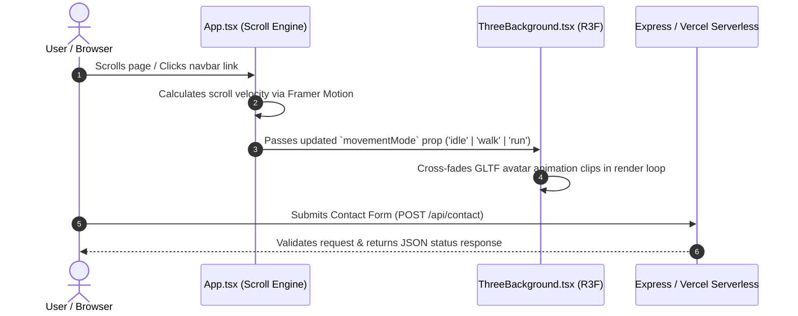

<div align="center">

  <h1>🌌 Kshitij Rastogi — 3D Developer Portfolio</h1>

  <p>
    <strong>A next-generation, highly interactive 3D web application powered by React, Three.js, R3F, Framer Motion, and Tailwind CSS.</strong>
  </p>

  <p>
    <a href="#-overview">Overview</a> •
    <a href="#-features--highlights">Features</a> •
    <a href="#%EF%B8%8F-tech-stack">Tech Stack</a> •
    <a href="#%EF%B8%8F-architecture--project-structure">Architecture</a> •
    <a href="#%EF%B8%8F-getting-started">Getting Started</a> •
    <a href="#-contact--connect">Contact</a>
  </p>

  <p>
    
    
    
    
    
    
    
    
  </p>

</div>

---

## 📖 Overview

Welcome to the source repository of **Kshitij Rastogi's 3D Portfolio**. Built with modern web standards, this portfolio combines immersive 3D canvas graphics, smooth velocity-driven character locomotion, real-time LeetCode problem-solving analytics, interactive project showcases, and a seamless serverless contact backend.

> [!TIP]
> **Key Highlight**: The 3D avatar on the background canvas seamlessly adapts its motion state (`idle` ↔ `walk` ↔ `run`) based on real-time scroll velocity calculated using `framer-motion` hooks!

---

## 🌟 Features & Highlights

| Feature | Description | Tech Stack |
| :--- | :--- | :--- |
| 🎨 **Interactive 3D Canvas** | Dynamic background scene rendering lighting, custom particle fields, and responsive 3D avatar GLTF models. | `Three.js`, `@react-three/fiber`, `drei` |
| 🏃 **Scroll-Reactive Locomotion** | Real-time scroll velocity tracking driving avatar animation state transitions (`idle`, `walk`, `run`). | `framer-motion`, `framer-motion-3d` |
| 📊 **LeetCode Stats Dashboard** | Dedicated interactive analytics section displaying solved problem metrics, difficulty breakdown, and topic tags. | `React`, `Lucide Icons` |
| 💼 **Career Experience Timeline** | Visual timeline detailing professional software engineering milestones, roles, and technical achievements. | `Framer Motion`, `Tailwind CSS` |
| 🚀 **Interactive Projects Grid** | Filterable project showcase featuring detailed cards, tech badges, live demos, and repository links. | `React`, `Tailwind CSS` |
| 📜 **Certifications & Resume** | Interactive certification card grid with preview modals and direct download options for resume. | `React`, Modal Portal |
| 📬 **Serverless Contact System** | Functional contact form with Express backend for local development and Vercel serverless function in production. | `Express.js`, `Vercel Serverless` |
| 🌙 **Sleek Dark Theme** | Ultra-responsive layout designed with Tailwind CSS v4, dynamic glassmorphism, and micro-animations. | `Tailwind CSS v4` |

---

## 🛠️ Tech Stack

### Core Ecosystem & 3D Engine


### Styling, Motion & UI


### Backend, Serverless & Infrastructure


---

## 🏗️ Architecture & Project Structure

The codebase is organized modularly into feature components, 3D graphics handlers, and API endpoints:

```
kshitij3jsportfolio/
├── 📁 api/
│   └── contact.ts           # Vercel serverless function for contact endpoint
├── 📁 public/                  # Static assets (3D GLTF models, icons, documents)
├── 📁 src/
│   ├── 📁 components/
│   │   ├── About.tsx        # Technical skills & bio section
│   │   ├── Certificates.tsx # Certifications grid & preview modal
│   │   ├── Contact.tsx      # Contact form component & API fetcher
│   │   ├── Education.tsx    # Academic timeline & qualifications
│   │   ├── Experience.tsx   # Professional history timeline
│   │   ├── Hero.tsx         # Intro landing hero with animated typewriter
│   │   ├── Leetcode.tsx     # Coding stats dashboard & topic analytics
│   │   ├── Navbar.tsx       # Navigation bar & smooth scroll triggers
│   │   ├── Projects.tsx     # Full-stack project cards showcase
│   │   ├── Resume.tsx       # Resume preview modal & quick downloads
│   │   └── ThreeBackground.tsx # R3F canvas, GLTF avatar loader & animation loop
│   ├── 📁 lib/
│   │   └── utils.ts         # Utility helpers (clsx + tailwind-merge)
│   ├── App.tsx              # Main layout, scroll velocity listener & state engine
│   ├── index.css            # Tailwind CSS styling & custom design tokens
│   └── main.tsx             # React application entry point
├── server.ts                # Express server for local development & API testing
├── vercel.json              # Vercel route rewrites & serverless configuration
├── vite.config.ts           # Vite build & React plugin configuration
└── package.json             # Dependencies and project scripts
```

### 🧠 Core System Flow



---

## ⚙️ Getting Started

Follow these step-by-step instructions to set up and run the project locally.

### 1️⃣ Prerequisites

Ensure you have the following installed on your local machine:
- **Node.js**: `v18.0.0` or higher ([Download Node.js](https://nodejs.org/))
- **Package Manager**: `npm` (v9+) included with Node, or `pnpm` / `yarn`

### 2️⃣ Clone the Repository

```bash
git clone https://github.com/your-username/kshitij3jsportfolio.git
cd kshitij3jsportfolio
```

### 3️⃣ Install Dependencies

```bash
npm install
```

### 4️⃣ Run Development Server

Choose one of the following execution modes:

#### 🟢 Standard Development Mode (Vite Server)
Launches Vite with fast Hot Module Replacement (HMR):
```bash
npm run dev
```
> Access app at: `http://localhost:5173`

#### 🟡 Full-Stack API Mode (Express Server)
Runs local Express backend for testing `/api/contact` alongside the app:
```bash
npx tsx server.ts
```
> Access app at: `http://localhost:3000`

---

## 📦 Production Build & Deployment

### Build Executable Bundle
To create an optimized production build in the `dist/` directory:
```bash
npm run build
```

### Preview Production Build Locally
```bash
npm run preview
```

### 🚀 Deploying to Vercel
This repository is pre-configured for Vercel deployment via `vercel.json`:
1. Push your repository to GitHub.
2. Import the repo in your [Vercel Dashboard](https://vercel.com/dashboard).
3. Vercel will automatically detect Vite and serve static assets along with serverless API routes in `api/contact.ts`.

---

## 📬 Contact & Connect

<div align="center">

  <a href="https://github.com/">
    
  </a>
  <a href="https://linkedin.com/">
    
  </a>
  <a href="mailto:your-email@example.com">
    
  </a>

</div>

---

## 📄 License

Distributed under the **MIT License**. See `LICENSE` for more information.

<div align="center">
  <sub>Built with ❤️ by <strong>Kshitij Rastogi</strong> using React, Three.js & Framer Motion</sub>
</div>
